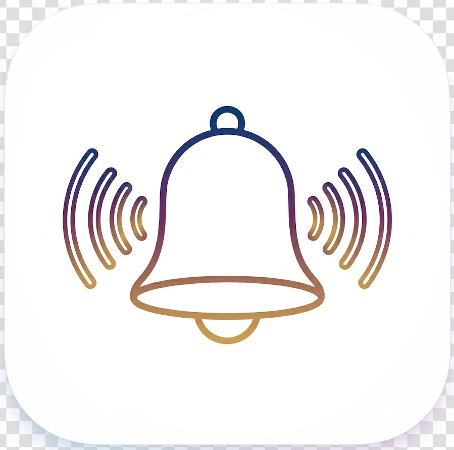

<h1 align="center">
  <br/>
  ChordVox IME
</h1>

<p align="center">
  <strong>A global AI smart dictation app built to save your time and protect your privacy.</strong><br>
  <strong>Zero Friction:</strong> Hold a hotkey to speak. AI instantly transcribes and polishes your words, pasting perfectly formatted text as soon as you release the key, so your typing can finally keep up with your brain.<br>
  <strong>Total Privacy:</strong> Powered entirely by local large language models. No internet required—your sensitive data and ideas never leave your hard drive.
</p>

<p align="center">
  <a href="https://github.com/GravityPoet/ChordVox/releases/latest"></a>
  <a href="https://github.com/GravityPoet/ChordVox/releases"></a>
  <a href="./LICENSE"></a>
  <a href="#"></a>
</p>

<p align="center">
  <strong>English</strong> | <a href="./README.md">中文</a>
</p>

---

### One-liner

> **Hold a hotkey and speak. Let AI instantly convert your speech into polished text and paste it for you—all while local models guarantee complete absolute privacy.**

---

### Key Features

- 🔒 **Privacy-first, Local-first** — Ship with built-in STT engines (whisper.cpp · NVIDIA Parakeet · SenseVoice). Your audio never leaves your machine unless you choose it to. Zero Python dependency; a single native binary handles everything.

- 💼 **Enterprise-Grade Features (Pro)** — Smoothly upgrade to unlock heavy-duty commercial capabilities: injection of professional-domain business dictionaries, complex anti-abuse and content moderation mechanisms, and integration of exclusive high-speed commercial endpoints (ready to use, no need to hunt for and configure third-party API keys).

- 🎯 **Agent Naming & Command Mode** — Personalize your AI assistant's name. Address it directly ("Hi ChordVox, draft an email…") to instantly switch from normal dictation to instruction-following mode.

- 📖 **Custom Dictionary** — Add domain-specific jargon, names, and technical terms to the in-app dictionary to drastically improve transcription accuracy for your specific workflows.

- 🧠 **AI Refinement Pipeline** — Raw speech → polished text. Connect to OpenAI / Anthropic / Google Gemini / Groq / any OpenAI-compatible endpoint, or run a local GGUF model via bundled llama.cpp. Includes smart contextual repair and format correction.

- ⌨️ **Auto Paste** — One hotkey triggers → records → transcribes → refines → pastes automatically. Works across every app on macOS (AppleScript), Windows (SendKeys + nircmd), and Linux (XTest / xdotool / wtype / ydotool). True Push-to-Talk with native keyboard hooks on macOS (Globe/Fn key via Swift listener) and Windows (low-level `WH_KEYBOARD_LL` hook).

- 🌍 **58 Languages · 10 Interface Languages** — Auto-detect or pin your language. Full UI localization in EN / ZH-CN / ZH-TW / JA / DE / FR / ES / PT / IT / RU.

- 🔄 **Dual-Profile Hotkeys** — Bind two independent hotkey profiles, each with its own STT engine, AI model, and refinement strategy. Switch workflows in a single keystroke.

- 🧹 **Storage Management** — Built-in cache cleanup tools. Easily remove downloaded Whisper/GGUF models to free up disk space with a single click in Settings.

---

### Use Cases / Problems Solved

| Pain Point | ChordVox Solution |
|---|---|
| Typing is slow; you think faster than you type | Speak naturally → get polished text in < 2 seconds |
| Cloud voice tools send audio to unknown servers | Local STT means audio stays on-device |
| Dictation output is raw and messy | AI refinement fixes grammar, punctuation, and formatting automatically |
| Switching between dictation app and target app breaks flow | Auto-paste removes the copy-paste step entirely |
| Enterprise / medical / legal jargon gets mangled | Custom Dictionary biases the model toward your domain-specific terms |
| You need different AI quality for different tasks | Dual-profile hotkeys: one for fast drafts (Groq), one for polished output (GPT-5 / Claude) |

---

### How It Works

```
┌─────────────┐    ┌──────────────────────────┐    ┌─────────────────┐    ┌──────────────┐
│  Hotkey      │───▶│  Audio Capture           │───▶│  STT Engine     │───▶│  AI Refine   │───▶  Auto
│  (Globe/Fn/  │    │  MediaRecorder → IPC     │    │  whisper.cpp    │    │  GPT / Claude│    Paste
│   Custom)    │    │  → temp .wav file        │    │  Parakeet       │    │  Gemini/Groq │
└─────────────┘    └──────────────────────────┘    │  SenseVoice     │    │  Local GGUF  │
                                                    │  Cloud STT      │    └──────────────┘
                                                    └─────────────────┘
```

**Tech Stack**: Electron 36 · React 19 · TypeScript · Vite · Tailwind CSS v4 · shadcn/ui · better-sqlite3 · whisper.cpp · sherpa-onnx (Parakeet) · llama.cpp · FFmpeg (bundled)

---

### Download

You can always find the latest format specific to your operating system on the [GitHub Releases](https://github.com/GravityPoet/ChordVox/releases/latest) page.

#### macOS First Launch

Unsigned builds may trigger Gatekeeper. Fix with:

```bash
xattr -dr com.apple.quarantine /Applications/ChordVox.app
open /Applications/ChordVox.app
```

---

### Quick Links

- 📦 [All Releases](https://github.com/GravityPoet/ChordVox/releases)
- 📖 [Legacy Technical README](docs/README_LEGACY.md)
- 📬 Contact: `moonlitpoet@proton.me`

---

### License

MIT License. See [LICENSE](./LICENSE) and [NOTICE](./NOTICE).
