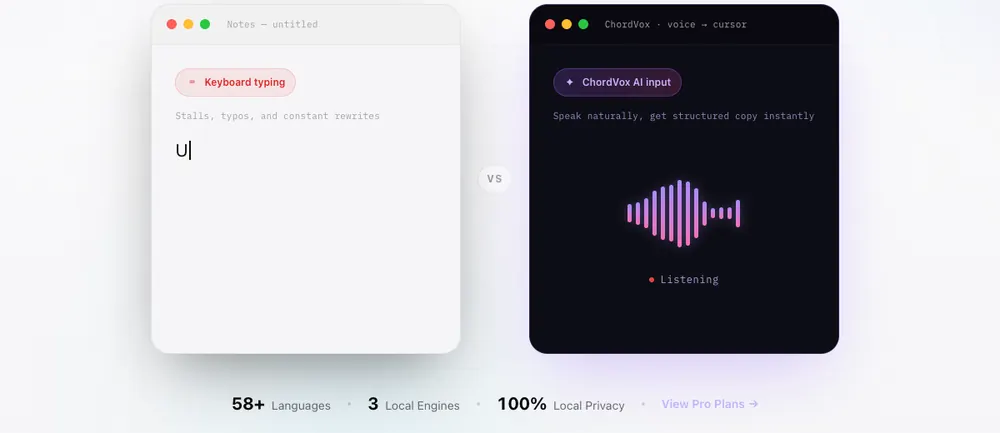

<p align="center">
  
</p>

<h1 align="center">ChordVox IME</h1>

<h2 align="center">Still fighting with slow typing or messy voice dictation?</h2>
<h3 align="center">"Your mouth is the fastest keyboard."</h3>

<p align="center">
  Capture ideas, write articles, and draft emails at the speed of speech. Completely local voice recognition—dictate instantly even offline.<br>
  Optionally plug in <b>the most powerful AI brains (ChatGPT / Gemini / Claude)</b> to auto-polish and format with a single sentence.
</p>

<p align="center">
  
</p>

<p align="center">
  Don't let your private conversations become free training data for AI models, and don't let your personal data fuel targeted ads.<br>
  <strong>Truly permanent, offline, and free—your privacy never leaves your device.</strong>
</p>

<p align="center">
  Choose your language:<br/>
  <a href="./README.md"></a>
  <a href="./README.zh.md"></a>
</p>

<p align="center">
  <a href="https://github.com/GravityPoet/ChordVox/releases"></a>
</p>

<p align="center">
  
</p>

---

### Why You Need ChordVox

**What you actually said**:  
> *"Umm... let's have a meeting this afternoon, maybe at 3, invite Bob... oh wait, I mean invite Alice. We need to discuss the UI redesign."*

- 🟢 **Standard Dictation**: Transcribes exactly that, keeping your filler words and hesitations.
- 🚀 **ChordVox AI**: `[Meeting Notice] Time: 3:00 PM today; Attendee: Alice; Topic: UI redesign discussion.`

**💡 A permanently free local speech-to-text engine that turns your spoken thoughts into perfect text.**

---

### Key Features

- ⌨️ **Speak into Text, Pasted Instantly** — One hotkey triggers the flow: record → transcribe → refine → paste right at your blinking cursor. Zero window switching, unbroken train of thought.

- 🧠 **AI Refinement Pipeline** — Raw speech → polished prose. Automatically strips filler words and perfects your punctuation. (*Power users can plug in their own local GGUF or top-tier APIs.*)

- 🎯 **Summon Your Executive Assistant** — Start your sentence with "Hi ChordVox, draft an email...", and it instantly transforms from a dictation tool into an instruction-following assistant.

- 📖 **Learns Your Jargon** — A built-in custom dictionary. Feed it your colleagues' names, coding acronyms, or medical terms, and it will transcribe them flawlessly.

- 🔒 **100% Local (Free Forever)** — Audio processing happens entirely on your machine. No Python setup, no cloud uploads, total privacy.

<details>
<summary><b>👀 Click to reveal hardcore geeky specs</b></summary>
<br>

- **Under the Hood** — Built on whisper.cpp, NVIDIA Parakeet, and SenseVoice. Connects to OpenAI compatible endpoints or uses bundled llama.cpp.
- **System Hooks** — Deep OS integration using AppleScript/Swift (macOS), SendKeys/low-level hooks (Windows), and XTest/ydotool (Linux).
- **Dual-Profile Hotkeys** — Bind two completely independent hotkey and engine/model workflows.
- **Storage Management** — 1-click removal of hefty Whisper/GGUF model caches.
</details>

---

### Use Cases / Problems Solved

| Pain Point | ChordVox Solution |
|---|---|
| Typing is slow; you think faster than you type | Speak naturally → get polished text in < 2 seconds |
| Cloud voice tools send audio to unknown servers | Local STT means audio stays on-device |
| Dictation output is raw and messy | AI refinement fixes grammar, punctuation, and formatting automatically |
| Switching between dictation app and target app breaks flow | Paste-at-cursor removes the copy-paste step entirely |
| Enterprise / medical / legal jargon gets mangled | Custom Dictionary biases the model toward your domain-specific terms |
| You need different AI quality for different tasks | Dual-profile hotkeys: one for fast drafts (Groq), one for polished output (GPT-5 / Claude) |

---

### How It Works

```
┌─────────────┐    ┌──────────────────────────┐    ┌─────────────────┐    ┌──────────────┐
│  Hotkey      │───▶│  Audio Capture           │───▶│  STT Engine     │───▶│  AI Refine   │───▶ Paste
│  (Globe/Fn/  │    │  MediaRecorder → IPC     │    │  whisper.cpp    │    │  GPT / Claude│    at
│   Custom)    │    │  → temp .wav file        │    │  Parakeet       │    │  Gemini/Groq │    Cursor
└─────────────┘    └──────────────────────────┘    │  SenseVoice     │    │  Local GGUF  │
                                                    │  Cloud STT      │    └──────────────┘
                                                    └─────────────────┘
```

**Tech Stack**: Electron 36 · React 19 · TypeScript · Vite · Tailwind CSS v4 · shadcn/ui · better-sqlite3 · whisper.cpp · sherpa-onnx (Parakeet) · llama.cpp · FFmpeg (bundled)

---

### Download

<p align="center">
  <a href="https://github.com/GravityPoet/ChordVox/releases"></a>
</p>

After opening the release page, click `Show all assets` if needed, then choose:

- macOS (Apple Silicon): `ChordVox-*-arm64.dmg`
- Windows (x64): `ChordVox-Setup-*.exe`
- Linux (x64): `ChordVox-*-linux-x86_64.AppImage`, `ChordVox-*-linux-amd64.deb`, or `ChordVox-*-linux-x86_64.rpm`

> [!IMPORTANT]
> **Essential for macOS First Launch**: Since this build is not from the App Store, it might be flagged as "damaged" by Gatekeeper. To fix this, run the following command in your terminal:
> ```bash
> xattr -dr com.apple.quarantine /Applications/ChordVox.app
> open /Applications/ChordVox.app
> ```

> Free forever local offline speech-to-text. Your voice stays private and on-device.

---

### Quick Links

- 🌐 [Website chordvox.com](https://chordvox.com)
- 📦 [All Releases](https://github.com/GravityPoet/ChordVox/releases)
- 📖 [Legacy Technical README](docs/README_LEGACY.md)
- 📬 Contact: `moonlitpoet@proton.me`

---

### License

MIT License. See [LICENSE](./LICENSE) and [NOTICE](./NOTICE).
